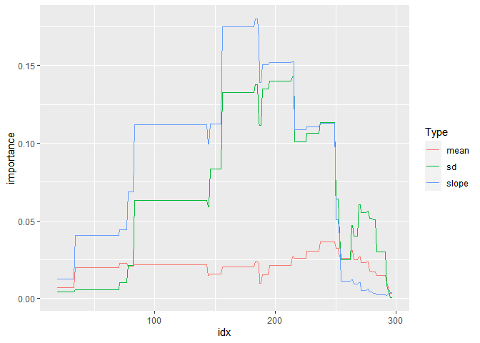

<!-- README.md is generated from README.Rmd. Please edit that file -->

# tsforest

<!-- badges: start -->
<!-- badges: end -->

The goal of tsforest is to provide an R implementation of the Time
Series Forest classification algorithm described by Deng et al (2013)
and documented on timeseriesclassification.com. There’s another R
package that implements many of these, but its backend is in Java which
can cause some installation and running problems.

## Installation

You can install the the development version from
[GitHub](https://github.com/) with:

``` r
# install.packages("devtools")
devtools::install_github("mattsq/tsforest")
```

This is still very much a work in progress! Eventually I’d like to
S3-ize the model objects, build tests and more example data, and in
general make it a more properly-featured model package.

## Usage

The package is pretty easy to use! Here’s a simple example:

``` r
library(tsforest)
data("FreezerRegularTrain_TRAIN")
data("FreezerRegularTrain_TEST")
model <- tsforest(FreezerRegularTrain_TRAIN, target = "target", n_trees = 50, verbose = FALSE)
#> New names:
#> • `mean_16_From296To298` -> `mean_16_From296To298...862`
#> • `sd_16_From296To298` -> `sd_16_From296To298...863`
#> • `slope_16_From296To298` -> `slope_16_From296To298...864`
#> • `mean_16_From296To298` -> `mean_16_From296To298...1321`
#> • `sd_16_From296To298` -> `sd_16_From296To298...1322`
#> • `slope_16_From296To298` -> `slope_16_From296To298...1323`
#> • `mean_15_From285To299` -> `mean_15_From285To299...1369`
#> • `sd_15_From285To299` -> `sd_15_From285To299...1370`
#> • `slope_15_From285To299` -> `slope_15_From285To299...1371`
#> • `mean_15_From285To299` -> `mean_15_From285To299...2236`
#> • `sd_15_From285To299` -> `sd_15_From285To299...2237`
#> • `slope_15_From285To299` -> `slope_15_From285To299...2238`
print(model)
#> Time series forest model converting time series of length: 301 
#> To length: 17 
#> Predicting on target class: target 
#> Includes underlying random forest model:
#> Ranger result
#> 
#> Call:
#>  ranger::ranger(form, data = featurized_df, num.trees = n_trees,      ...) 
#> 
#> Type:                             Classification 
#> Number of trees:                  50 
#> Sample size:                      150 
#> Number of independent variables:  2550 
#> Mtry:                             50 
#> Target node size:                 1 
#> Variable importance mode:         none 
#> Splitrule:                        gini 
#> OOB prediction error:             0.67 %
```

Predictions use the standard S3 predict method, and return a vector of
predictions:

``` r
preds <- predict(model, FreezerRegularTrain_TEST, verbose = FALSE)
#> New names:
#> • `mean_16_From296To298` -> `mean_16_From296To298...862`
#> • `sd_16_From296To298` -> `sd_16_From296To298...863`
#> • `slope_16_From296To298` -> `slope_16_From296To298...864`
#> • `mean_16_From296To298` -> `mean_16_From296To298...1321`
#> • `sd_16_From296To298` -> `sd_16_From296To298...1322`
#> • `slope_16_From296To298` -> `slope_16_From296To298...1323`
#> • `mean_15_From285To299` -> `mean_15_From285To299...1369`
#> • `sd_15_From285To299` -> `sd_15_From285To299...1370`
#> • `slope_15_From285To299` -> `slope_15_From285To299...1371`
#> • `mean_15_From285To299` -> `mean_15_From285To299...2236`
#> • `sd_15_From285To299` -> `sd_15_From285To299...2237`
#> • `slope_15_From285To299` -> `slope_15_From285To299...2238`
table(preds$predictions, FreezerRegularTrain_TEST$target)
#>    
#>        1    2
#>   1 1420    8
#>   2    5 1417
```

There’s also a more experimental (and not at all theoretically
grounded!) function that takes advantage of the fact that variables are
(partially) defined as intervals to plot the variable importance across
the time series interval. You can use any summary function, although sum
seems to work the best:

``` r
model <- tsforest(FreezerRegularTrain_TRAIN, 
                  importance = 'permutation', 
                  verbose = FALSE)
intervalwise_variable_importance(model, summary_function = mean)
```



You can also plot an individual example using the function, where the
example will be scaled correctly to the importance values:

``` r
intervalwise_variable_importance(model, 
                                 summary_function = mean, 
                                 optional_example_rownumber = 2)
```


We implement random forest here for convenience, but the bag of features
used by Time Series Forest can be used by other models -
`tsforest::new_tsforest()` and `tsforest::featurized_df` allow you to
apply the features using your own models. This interface isn’t perfect,
so it may change. Here, in slightly goofy example, we use logistic
regression instead of random forests:

``` r
data("FreezerRegularTrain_TRAIN")
data("FreezerRegularTrain_TEST")
trained_tsobj <- new_tsforest(FreezerRegularTrain_TRAIN, target = "target", min_length = 2, n_trees = 1)
featurized_train <- featurize_df(FreezerRegularTrain_TRAIN, trained_tsobj, verbose = FALSE, tree_idx = 1)
featurized_train$target <- FreezerRegularTrain_TRAIN$target
glm_model <- glm(target ~ ., data = featurized_train, family = "binomial")
#> Warning: glm.fit: algorithm did not converge
#> Warning: glm.fit: fitted probabilities numerically 0 or 1 occurred
summary(glm_model)
#> 
#> Call:
#> glm(formula = target ~ ., family = "binomial", data = featurized_train)
#> 
#> Coefficients:
#>                         Estimate Std. Error z value Pr(>|z|)
#> (Intercept)           -3.060e+02  2.278e+07       0        1
#> mean_1_From128To138   -5.546e+01  1.503e+07       0        1
#> sd_1_From128To138     -9.476e+01  6.726e+06       0        1
#> slope_1_From128To138  -5.014e+02  2.576e+07       0        1
#> mean_2_From57To267    -1.537e+03  6.547e+07       0        1
#> sd_2_From57To267       2.309e+02  1.112e+07       0        1
#> slope_2_From57To267    1.146e+05  2.645e+09       0        1
#> mean_3_From153To200   -2.793e+02  1.834e+07       0        1
#> sd_3_From153To200     -2.055e+00  3.532e+06       0        1
#> slope_3_From153To200   1.836e+03  1.917e+08       0        1
#> mean_4_From142To150    9.644e+01  9.628e+06       0        1
#> sd_4_From142To150     -1.521e+02  6.575e+06       0        1
#> slope_4_From142To150   1.602e+02  2.049e+07       0        1
#> mean_5_From255To264   -8.638e+00  1.346e+06       0        1
#> sd_5_From255To264      1.615e+01  1.663e+06       0        1
#> slope_5_From255To264   2.129e+01  6.254e+06       0        1
#> mean_6_From215To270    5.033e+02  4.756e+07       0        1
#> sd_6_From215To270     -3.003e+01  3.952e+06       0        1
#> slope_6_From215To270   2.696e+03  4.461e+08       0        1
#> mean_7_From94To115    -1.044e+03  2.914e+07       0        1
#> sd_7_From94To115      -5.780e+02  1.178e+07       0        1
#> slope_7_From94To115   -2.926e+02  9.707e+07       0        1
#> mean_8_From38To129    -4.175e+03  4.721e+08       0        1
#> sd_8_From38To129       1.008e+04  4.109e+08       0        1
#> slope_8_From38To129   -2.387e+04  8.588e+09       0        1
#> mean_9_From3To114      3.456e+03  3.844e+08       0        1
#> sd_9_From3To114       -8.944e+03  7.369e+08       0        1
#> slope_9_From3To114     1.554e+05  1.355e+10       0        1
#> mean_10_From68To283    5.403e+03  1.000e+08       0        1
#> sd_10_From68To283      1.609e+01  1.195e+07       0        1
#> slope_10_From68To283  -1.701e+05  3.556e+09       0        1
#> mean_11_From182To216   5.986e+01  9.949e+06       0        1
#> sd_11_From182To216     4.584e+01  5.073e+06       0        1
#> slope_11_From182To216  6.331e+02  6.849e+07       0        1
#> mean_12_From250To301   3.201e+02  4.717e+07       0        1
#> sd_12_From250To301     9.274e+01  2.801e+06       0        1
#> slope_12_From250To301  6.818e+03  4.476e+08       0        1
#> mean_13_From216To244   4.827e+01  1.043e+07       0        1
#> sd_13_From216To244     1.290e+01  2.036e+06       0        1
#> slope_13_From216To244  1.155e+02  4.246e+07       0        1
#> mean_14_From112To158   4.710e+00  4.102e+07       0        1
#> sd_14_From112To158     8.773e+01  1.839e+07       0        1
#> slope_14_From112To158 -6.753e+03  5.371e+08       0        1
#> mean_15_From271To301   2.885e+02  6.415e+07       0        1
#> sd_15_From271To301    -5.435e+01  4.017e+06       0        1
#> slope_15_From271To301 -1.016e+03  1.349e+08       0        1
#> mean_16_From281To288   2.501e+00  1.289e+06       0        1
#> sd_16_From281To288     1.187e+02  3.891e+06       0        1
#> slope_16_From281To288  3.478e+02  1.042e+07       0        1
#> mean_17_From18To245    3.809e+03  4.885e+08       0        1
#> sd_17_From18To245      2.181e+02  2.593e+07       0        1
#> slope_17_From18To245  -1.694e+05  1.837e+10       0        1
#> 
#> (Dispersion parameter for binomial family taken to be 1)
#> 
#>     Null deviance: 2.0794e+02  on 149  degrees of freedom
#> Residual deviance: 1.2585e-09  on  98  degrees of freedom
#> AIC: 104
#> 
#> Number of Fisher Scoring iterations: 25
```

``` r
featurized_test <- featurize_df(FreezerRegularTrain_TEST, trained_tsobj, verbose = FALSE, tree_idx = 1)
preds <- predict(glm_model, featurized_test, type = "response")
preds <- as.numeric(preds > 0.5) + 1
featurized_test$target <- FreezerRegularTrain_TEST$target
table(preds, featurized_test$target)
#>      
#> preds    1    2
#>     1 1415   17
#>     2   10 1408
```
