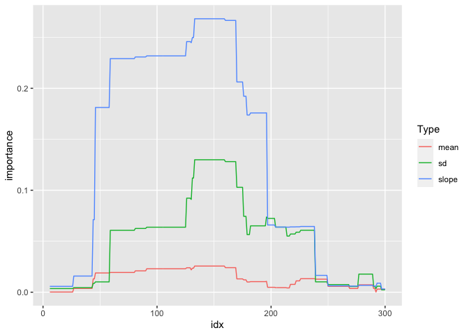
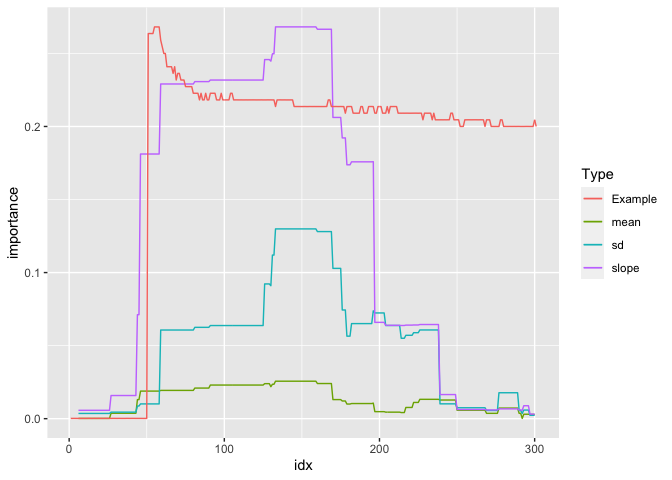

<!-- README.md is generated from README.Rmd. Please edit that file -->

# tsforest

<!-- badges: start -->

<!-- badges: end -->

The goal of tsforest is to provide an R implementation of the Time
Series Forest classification algorithm described by Deng et al (2013)
and documented on timeseriesclassification.com. There’s another R
package that implements many of these, but its backend is in Java which
can cause some installation and running problems.

## Installation

You can install the the development version from
[GitHub](https://github.com/) with:

``` r
# install.packages("devtools")
devtools::install_github("mattsq/tsforest")
```

This is still very much a work in progress\! Eventually I’d like to
S3-ize the model objects, build tests and more example data, and in
general make it a more properly-featured model package.

## Usage

The package is pretty easy to use\! Here’s a simple example:

``` r
library(tsforest)
data("FreezerRegularTrain_TRAIN")
data("FreezerRegularTrain_TEST")
model <- tsforest(FreezerRegularTrain_TRAIN, target = "target")
#> Training model with 17 intervals...
#> 1: Interval from 298 to 300
#> 2: Interval from 118 to 196
#> 3: Interval from 202 to 276
#> 4: Interval from 61 to 237
#> 5: Interval from 250 to 264
#> 6: Interval from 109 to 294
#> 7: Interval from 264 to 300
#> 8: Interval from 27 to 133
#> 9: Interval from 47 to 121
#> 10: Interval from 122 to 149
#> 11: Interval from 113 to 215
#> 12: Interval from 294 to 301
#> 13: Interval from 18 to 273
#> 14: Interval from 262 to 284
#> 15: Interval from 108 to 245
#> 16: Interval from 292 to 299
#> 17: Interval from 257 to 285
preds <- predict_tsforest(model, FreezerRegularTrain_TEST)
#> 1: Interval from 298 to 300
#> 2: Interval from 118 to 196
#> 3: Interval from 202 to 276
#> 4: Interval from 61 to 237
#> 5: Interval from 250 to 264
#> 6: Interval from 109 to 294
#> 7: Interval from 264 to 300
#> 8: Interval from 27 to 133
#> 9: Interval from 47 to 121
#> 10: Interval from 122 to 149
#> 11: Interval from 113 to 215
#> 12: Interval from 294 to 301
#> 13: Interval from 18 to 273
#> 14: Interval from 262 to 284
#> 15: Interval from 108 to 245
#> 16: Interval from 292 to 299
#> 17: Interval from 257 to 285
table(preds$predictions, FreezerRegularTrain_TEST$target)
#>    
#>        1    2
#>   1 1415   20
#>   2   10 1405
```

There’s also a more experimental (and not at all theoretically
grounded\!) function that takes advantage of the fact that variables are
(partially) defined as intervals to plot the variable importance across
the time series interval. You can use any summary function, although sum
seems to work the best:

``` r
model <- tsforest(FreezerRegularTrain_TRAIN, 
                  importance = 'permutation', 
                  verbose = FALSE)
intervalwise_variable_importance(model, summary_function = sum)
```



You can also plot an individual example using the function, where the
example will be scaled correctly to the importance values:

``` r
intervalwise_variable_importance(model, 
                                 summary_function = sum, 
                                 optional_example_rownumber = 1)
```


