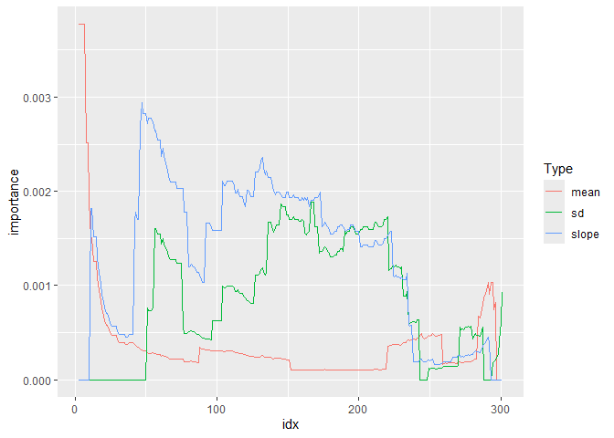
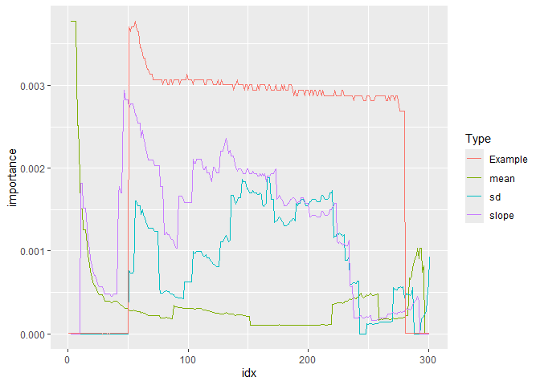

<!-- README.md is generated from README.Rmd. Please edit that file -->

# tsforest

<!-- badges: start -->

<!-- badges: end -->

The goal of tsforest is to provide an R implementation of the Time
Series Forest classification algorithm described by Deng et al (2013)
and documented on timeseriesclassification.com. There’s another R
package that implements many of these, but its backend is in Java which
can cause some installation and running problems.

## Installation

You can install the the development version from
[GitHub](https://github.com/) with:

``` r
# install.packages("devtools")
devtools::install_github("mattsq/tsforest")
```

This is still very much a work in progress\! Eventually I’d like to
S3-ize the model objects, build tests and more example data, and in
general make it a more properly-featured model package.

## Usage

The package is pretty easy to use\! Here’s a simple example:

``` r
library(tsforest)
data("FreezerRegularTrain_TRAIN")
data("FreezerRegularTrain_TEST")
model <- tsforest(FreezerRegularTrain_TRAIN, target = "target")
#> Creating features with 17 intervals...
#> 1: Interval from 239 to 242
#> 2: Interval from 296 to 299
#> 3: Interval from 98 to 261
#> 4: Interval from 53 to 145
#> 5: Interval from 15 to 83
#> 6: Interval from 257 to 279
#> 7: Interval from 202 to 250
#> 8: Interval from 277 to 286
#> 9: Interval from 115 to 267
#> 10: Interval from 238 to 243
#> 11: Interval from 210 to 269
#> 12: Interval from 68 to 220
#> 13: Interval from 1 to 152
#> 14: Interval from 234 to 237
#> 15: Interval from 247 to 259
#> 16: Interval from 40 to 218
#> 17: Interval from 214 to 218
print(model)
#> Time series forest model converting time series of length: 301 
#> To length: 51 
#> Predicting on target class: target
#> Warning in if (is.na(model$ranger_model)) {: the condition has length > 1 and
#> only the first element will be used
#> Includes underlying random forest model:
#> Ranger result
#> 
#> Call:
#>  ranger::ranger(form_for_pred, data = returned_object$featurized_df,      ...) 
#> 
#> Type:                             Classification 
#> Number of trees:                  500 
#> Sample size:                      150 
#> Number of independent variables:  51 
#> Mtry:                             7 
#> Target node size:                 1 
#> Variable importance mode:         none 
#> Splitrule:                        gini 
#> OOB prediction error:             0.67 %
```

Predictions use the standard S3 predict method, and return a vector of
predictions:

``` r
preds <- predict(model, FreezerRegularTrain_TEST)
#> Fitting new data to trained intervals:
#> Creating features with 17 intervals...
#> 1: Interval from 239 to 242
#> 2: Interval from 296 to 299
#> 3: Interval from 98 to 261
#> 4: Interval from 53 to 145
#> 5: Interval from 15 to 83
#> 6: Interval from 257 to 279
#> 7: Interval from 202 to 250
#> 8: Interval from 277 to 286
#> 9: Interval from 115 to 267
#> 10: Interval from 238 to 243
#> 11: Interval from 210 to 269
#> 12: Interval from 68 to 220
#> 13: Interval from 1 to 152
#> 14: Interval from 234 to 237
#> 15: Interval from 247 to 259
#> 16: Interval from 40 to 218
#> 17: Interval from 214 to 218
table(preds$predictions, FreezerRegularTrain_TEST$target)
#>    
#>        1    2
#>   1 1412    7
#>   2   13 1418
```

There’s also a more experimental (and not at all theoretically
grounded\!) function that takes advantage of the fact that variables are
(partially) defined as intervals to plot the variable importance across
the time series interval. You can use any summary function, although sum
seems to work the best:

``` r
model <- tsforest(FreezerRegularTrain_TRAIN, 
                  importance = 'permutation', 
                  verbose = FALSE)
intervalwise_variable_importance(model, summary_function = sum)
```



You can also plot an individual example using the function, where the
example will be scaled correctly to the importance values:

``` r
intervalwise_variable_importance(model, 
                                 summary_function = sum, 
                                 optional_example_rownumber = 1)
```



We implement random forest here for convenience, but the bag of features
used by Time Series Forest can be used by other models -
`tsforest::new_tsforest()` and `tsforest::featurized_df` allow you to
apply the features using your own models. This interface isn’t perfect,
so it may change. Here, in slightly goofy example, we use logistic
regression instead of random forests:

``` r
data("FreezerRegularTrain_TRAIN")
data("FreezerRegularTrain_TEST")
trained_tsobj <- new_tsforest(FreezerRegularTrain_TRAIN, target = "target", min_length = 2)
featurized_train <- featurize_df(FreezerRegularTrain_TRAIN, trained_tsobj, verbose = FALSE)
glm_model <- glm(target ~ ., data = featurized_train, family = "binomial")
#> Warning: glm.fit: algorithm did not converge
#> Warning: glm.fit: fitted probabilities numerically 0 or 1 occurred
summary(glm_model)
#> 
#> Call:
#> glm(formula = target ~ ., family = "binomial", data = featurized_train)
#> 
#> Deviance Residuals: 
#>        Min          1Q      Median          3Q         Max  
#> -9.758e-06  -1.142e-06   0.000e+00   1.277e-06   8.392e-06  
#> 
#> Coefficients:
#>                         Estimate Std. Error z value Pr(>|z|)
#> (Intercept)           -8.188e+02  1.667e+07       0        1
#> mean_1_From143To266    1.741e+03  5.227e+07       0        1
#> sd_1_From143To266      1.535e+01  3.102e+06       0        1
#> slope_1_From143To266  -3.664e+04  1.042e+09       0        1
#> mean_2_From36To236    -6.048e+02  2.446e+07       0        1
#> sd_2_From36To236       1.331e+03  1.692e+07       0        1
#> slope_2_From36To236    1.057e+05  1.104e+09       0        1
#> mean_3_From168To199    1.101e+02  4.919e+06       0        1
#> sd_3_From168To199     -1.459e+01  1.988e+06       0        1
#> slope_3_From168To199  -7.152e+02  2.824e+07       0        1
#> mean_4_From88To272    -4.040e+03  1.237e+08       0        1
#> sd_4_From88To272       1.450e+02  7.311e+06       0        1
#> slope_4_From88To272    1.622e+05  3.413e+09       0        1
#> mean_5_From69To111    -4.408e+02  5.300e+07       0        1
#> sd_5_From69To111       8.392e+01  1.172e+07       0        1
#> slope_5_From69To111   -6.240e+03  5.998e+08       0        1
#> mean_6_From250To287    1.634e+02  2.418e+07       0        1
#> sd_6_From250To287      2.489e+01  1.999e+06       0        1
#> slope_6_From250To287  -2.206e+02  1.966e+08       0        1
#> mean_7_From68To169     5.172e+03  1.175e+08       0        1
#> sd_7_From68To169      -6.607e+02  2.039e+07       0        1
#> slope_7_From68To169   -1.296e+05  3.115e+09       0        1
#> mean_8_From298To300   -1.608e+02  7.626e+06       0        1
#> sd_8_From298To300     -3.928e+01  1.232e+06       0        1
#> slope_8_From298To300  -7.934e+02  3.814e+07       0        1
#> mean_9_From280To290   -9.847e+01  6.896e+06       0        1
#> sd_9_From280To290      1.105e+00  2.246e+06       0        1
#> slope_9_From280To290   2.768e+01  1.392e+07       0        1
#> mean_10_From64To94    -1.466e+03  4.612e+07       0        1
#> sd_10_From64To94       1.423e+03  3.303e+07       0        1
#> slope_10_From64To94    1.584e+04  4.067e+08       0        1
#> mean_11_From268To270  -2.155e+02  6.692e+06       0        1
#> sd_11_From268To270    -2.018e+01  6.643e+05       0        1
#> slope_11_From268To270 -1.054e+03  3.208e+07       0        1
#> mean_12_From216To283  -1.660e+02  2.200e+07       0        1
#> sd_12_From216To283    -4.402e+01  2.122e+06       0        1
#> slope_12_From216To283 -1.824e+03  2.807e+08       0        1
#> mean_13_From240To279  -7.672e+01  1.781e+07       0        1
#> sd_13_From240To279     7.475e+00  2.883e+06       0        1
#> slope_13_From240To279 -4.786e+02  1.798e+08       0        1
#> mean_14_From101To145   2.455e+02  3.711e+07       0        1
#> sd_14_From101To145     3.018e+02  1.282e+07       0        1
#> slope_14_From101To145  4.811e+03  3.249e+08       0        1
#> mean_15_From246To294   2.722e+01  7.307e+06       0        1
#> sd_15_From246To294     2.056e+02  4.814e+06       0        1
#> slope_15_From246To294  6.114e+03  1.983e+08       0        1
#> mean_16_From30To40    -6.292e+02  2.874e+08       0        1
#> sd_16_From30To40      -8.178e+04  3.959e+09       0        1
#> slope_16_From30To40   -2.864e+04  8.774e+09       0        1
#> mean_17_From62To286   -5.590e+02  1.686e+08       0        1
#> sd_17_From62To286     -5.863e+01  9.036e+06       0        1
#> slope_17_From62To286   2.869e+04  7.237e+09       0        1
#> 
#> (Dispersion parameter for binomial family taken to be 1)
#> 
#>     Null deviance: 2.0794e+02  on 149  degrees of freedom
#> Residual deviance: 1.2420e-09  on  98  degrees of freedom
#> AIC: 104
#> 
#> Number of Fisher Scoring iterations: 25
```

``` r
featurized_test <- featurize_df(FreezerRegularTrain_TEST, trained_tsobj, verbose = FALSE)
preds <- predict(glm_model, featurized_test, type = "response")
preds <- as.numeric(preds > 0.5) + 1
table(preds, featurized_test$target)
#>      
#> preds    1    2
#>     1 1418   28
#>     2    7 1397
```
